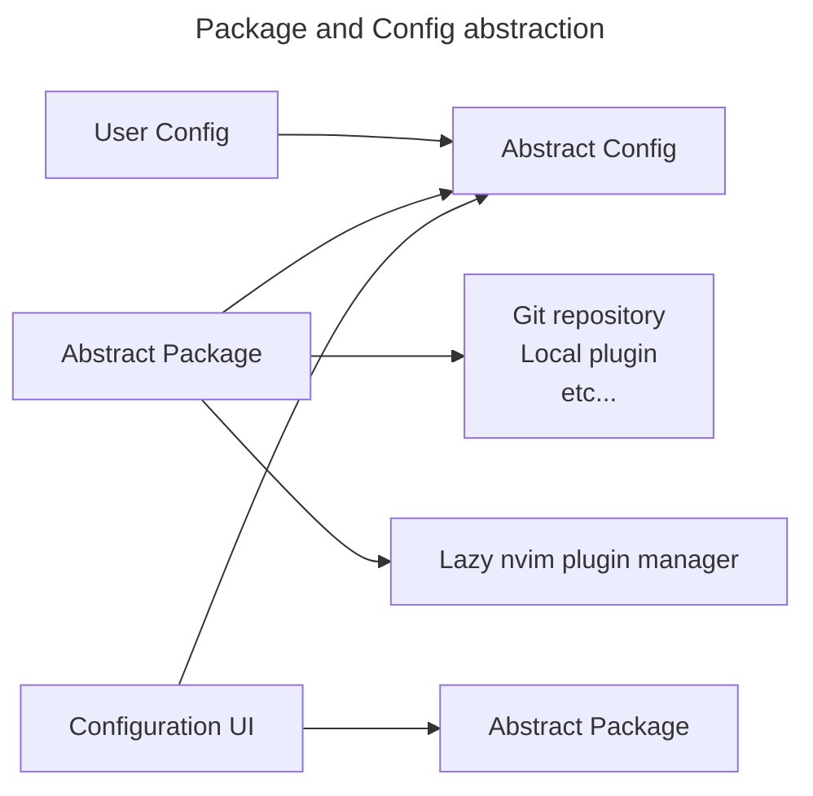

# My Neovim config

**NOTE:** This is a work in progress. 🛠️

This branch is my attempt to move away from AstroNvim and just use Lazy.
Coming from AstroNvim, this config will be inspired by AstroNvim, but
more minimal for my usecase, specifically C++ development. I don't need
to support everything possible like Astro does.

## TODO:
- [ ] Finish setting up config abstractions. I want to have a declarative
config of things I want to enable/disable, possibly load from a yaml file.
- [x] Setup [cmake-tools.nvim](https://github.com/Civitasv/cmake-tools.nvim)
- [ ] Setup [neotest](https://github.com/nvim-neotest/neotest)
- [ ] Setup [neotest-gtest](https://github.com/alfaix/neotest-gtest)
- [ ] Setup [hydra.nvim](https://github.com/nvimtools/hydra.nvim)

### Much later, Wish list
- [ ] A local godbolt clone using Treesitter and compile_commands.json
- [ ] A decent assembly lsp that supports what gcc, clang, and msvc output

## Plan for abstracting config

