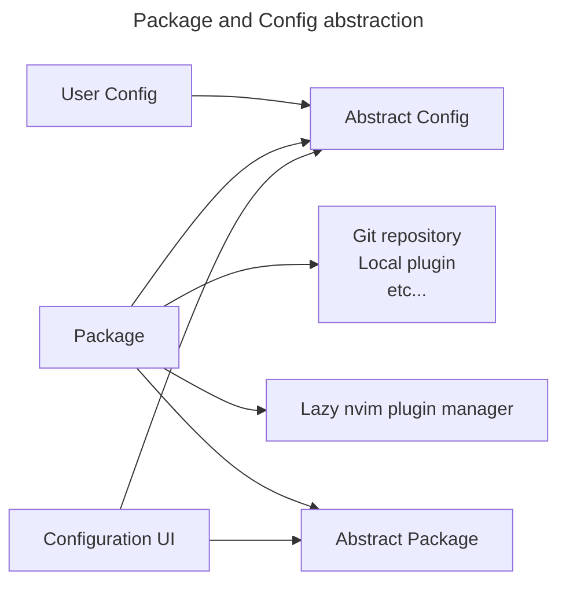

# My Neovim config

**NOTE:** This is a work in progress. 🛠️

This branch is my attempt to move away from AstroNvim and just use Lazy.
Coming from AstroNvim, this config will be inspired by AstroNvim, but
more minimal for my usecase, specifically C++ development. I don't need
to support everything possible like Astro does.

### Much later, Wish list
- [ ] A local godbolt clone using Treesitter and compile_commands.json
- [ ] A decent assembly lsp that supports what gcc, clang, and msvc output

## Plan for abstracting config

### TODO:
Consider "Package Provider" and "Config Provider"
sources. A "Package Provider" can implement driving
the plugin manager and using "Abstract Configs" to
configure plugins, thus providing a "Package".

"Config Provider" would be relatively stable, but
can be a UI or config file in yaml, json, or a raw
lua file with custom callbacks.

# Info about this config

## Workspaces, Tabs, and Buffers, Oh my!
This config is setup to work without tmux. 😈 

Use `<Leader>tw` to open a workspace in a new tab

Buffers are scoped to tabs using [scope](https://github.com/tiagovla/scope.nvim).
This means you can have multiple workspaces open in separate tabs with buffers
scoped to that workspace/tab.

With scoped buffers, tabs are like windows in tmux.

Using [tabby](https://github.com/nanozuki/tabby.nvim), opened tabs are shown in the upper
left corner of Neovim, and buffers open in the current tab are listed in the upper left.

You can save a session with multiple open workspaces/tabs using [resession.nvim](https://github.com/stevearc/resession.nvim)

### Keymaps related to Workspaces and Tabs
- `<Leader>ta` Open a new tab
- `<Leader>tn` Move to next tab (to the right)
- `<Leader>tp` Move to prev tab (to the left)
- `<M-]>` Move to next tab (to the right)
- `<M-[>` Move to prev tab (to the left)
- `<Leader>tc` Close the current tab

With [which-key](https://github.com/folke/which-key.nvim) you can use:

`<Leader>t` to view keymaps related to tabs

## TODO:
- [ ] Finish setting up config abstractions. I want to have a declarative
config of things I want to enable/disable, possibly load from a yaml file.
- [ ] More documentation

